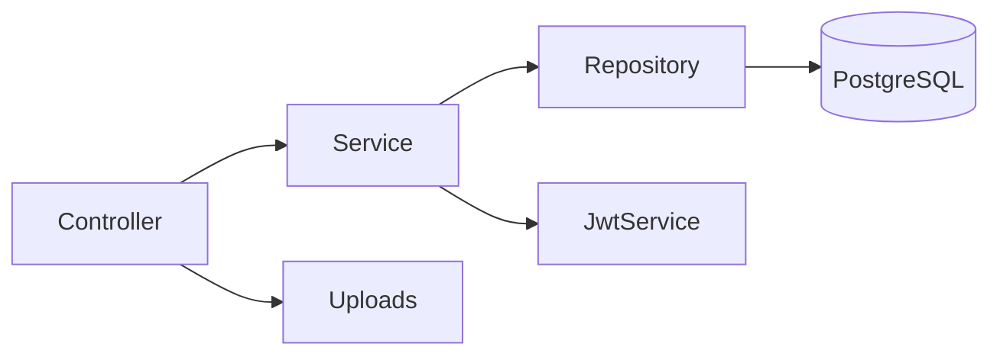

# Arquitetura (Java)

- **Spring Boot 3** em camadas: Controller → Service → Repository (JPA) → PostgreSQL.
- **JWT** para autenticação (stateless).
- **Upload** com Multipart (limite 5MB por arquivo).
- **Padrões**: Repository, Factory (p/ services, se necessário), Strategy (filtros futuros).
- **Diagrama** (simplificado):

